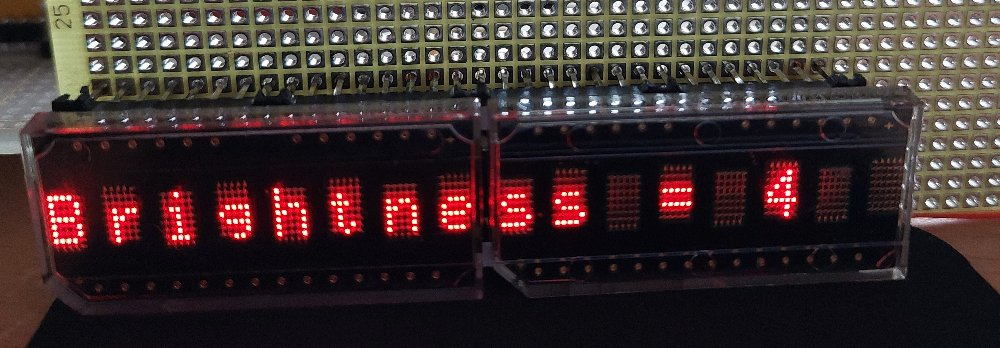
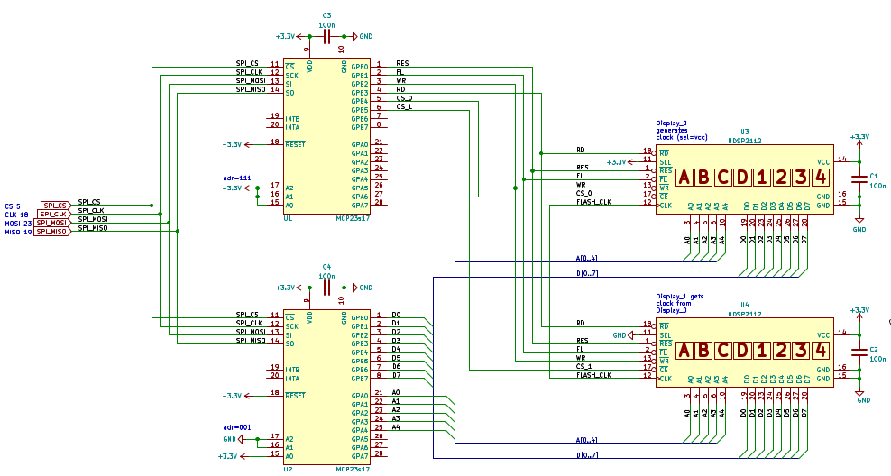

# esp32_hdsp2112
A sample ESP32 application for two vintage HDSP-2112 displays, driven with two MCP23s17 16-bit I/O expander.
Tested with VSCode + platformio and a 38pin ESP32 NodeMCU board.

```ini
[env:esp32dev]
platform  = espressif32
board     = esp32dev
framework = arduino
```

 

## wiring of the two MCP23s17 
The two MCP23s17 can be connected to the SPI bus in parallel and with a common CS signal. Doing so, please note the following. 
1. The address pins A0..A2 of the MCP23s17 must be wired so that each module has a unique address. 
```
pre-assigned Address-Pins in this setup: 
device_0 (U1) address = 111 --> spi-control-byte = 0100111x  
device_1 (U2) address = 001 --> spi-control-byte = 0100001x  
```

2. Additionally, when initializing the two MCP23s17, the `HAEN` bit (=hardware address enable) must be set within the `IOCON` register (=I/O expander configuration). 

3. The devices are selected via the **SPI control byte**  according to the pre-assigned address pins A0..A2 
(see [mcp23s17.pdf](doc/mcp23s17.pdf) , Figure 3-5: **SPI-Control-Byte Format**, page 15)


The table shows the wiring of the SPI connections for the EPS32 and the MCP23s17

| ESP32-GPIO | MCP23s17 | Comment                       |
|:----------:|:--------:|:------------------------------|
| 05         | 11       | SPI_CS,  chip-select          |
| 18         | 12       | SPI_CLK, clock                |
| 23         | 13       | SPI_MOSI, master-out-slave-in |
| 19         | 14       | SPI_MISO, master-in-slave-out |


## wiring of the HDSP-2112
Two HDSP-2112 displays are driven in parallel, each is selected via its own chip-select signal

---
> [!NOTE]
> The recommended supply voltage is [4.5V to 5.5V]. The circuit used here operates the displays with 3.3V, which remains within the abs. maximum range [-0.3V to 7.0V] of the data sheet. Even with this lower than suggested voltage, the displays work reliably and are shining bright. Using 3.3V has the advantage that no level shifters are required and the MCP23s17 can be connected directly to the ESP32. 
---

For a proper flashing function, the displays were wired so that the left display generates the clock for the right display. ``Left SEL=3.3V`` , ``Right SEL=GND`` See specification [hp_HDSP-2112.pdf](doc/hp_HDSP-2112.pdf) page 9:  *clock-select* (**CLS** pin 11) and *clock-input/output* (**CLK**  pin 12) 




## SW hints
1. MCP23s17 driver library
 The [Adafruit-MCP23017-Arduino-Library](https://github.com/adafruit/Adafruit-MCP23017-Arduino-Library) is used to control the MCP23s17 port expander

2. some member functions:
   - `Reset()` reset the displays (hardware)
   - `Clear()` fill display with blanks
   -  `SetFlashBits()` and `FlashMode()` to flash  individual characters of the displays
   - `BlinkMode()` to let the whole display blink
   - `SetBrightness()` to adjust the brightness
   - `Selftest()` perform a selftest 
   
---
> [!NOTE]
>The Selftest() function itself works, however reading the status-bit and showing `OK` or `Failed` is on the 
todo-list. Reading means: change the `m_mcp0.pinMode()` from OUTPUT to INPUT and set RD signal for the MCP23s17 accordingly

---
> [!NOTE]
> the class `HDSP2112` is derived from the class `Print` , so the member functions like printf() can be used easily 
---
