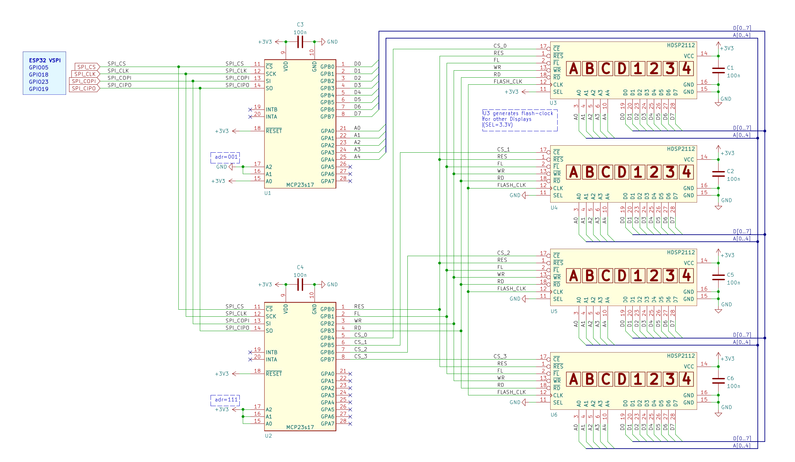

# esp32_hdsp2112
sample ESP32 application for vintage HDSP-2112 Displays, driven with MCP23s17 portexpander.

 

- two MCP23s17 portexpander are driven via SPI with HEAN function activated, i.e. both mcp23s17 are connected to the standard VSPI of the ESP32

| Signal   | ESP32-GPIO | Comment               |
|:---------|:----------:|:----------------------|
| SPI_CS   | 05         |chip-select for both   |
| SPI_CLK  | 18         |SPI clock              |
| SPI_MISO | 19         |SPI master-in-slave-out|
| SPI_MOSI | 23         |SPI master-out-slave-in|

- two HDSP-2112 displays are driven in parallel
- the left display generates the flashing clock for the the right display

- use of Adafruit lib https://github.com/adafruit/Adafruit-MCP23017-Arduino-Library) for driving the MCP23s17 
- added flashing mode
- added blinking mode